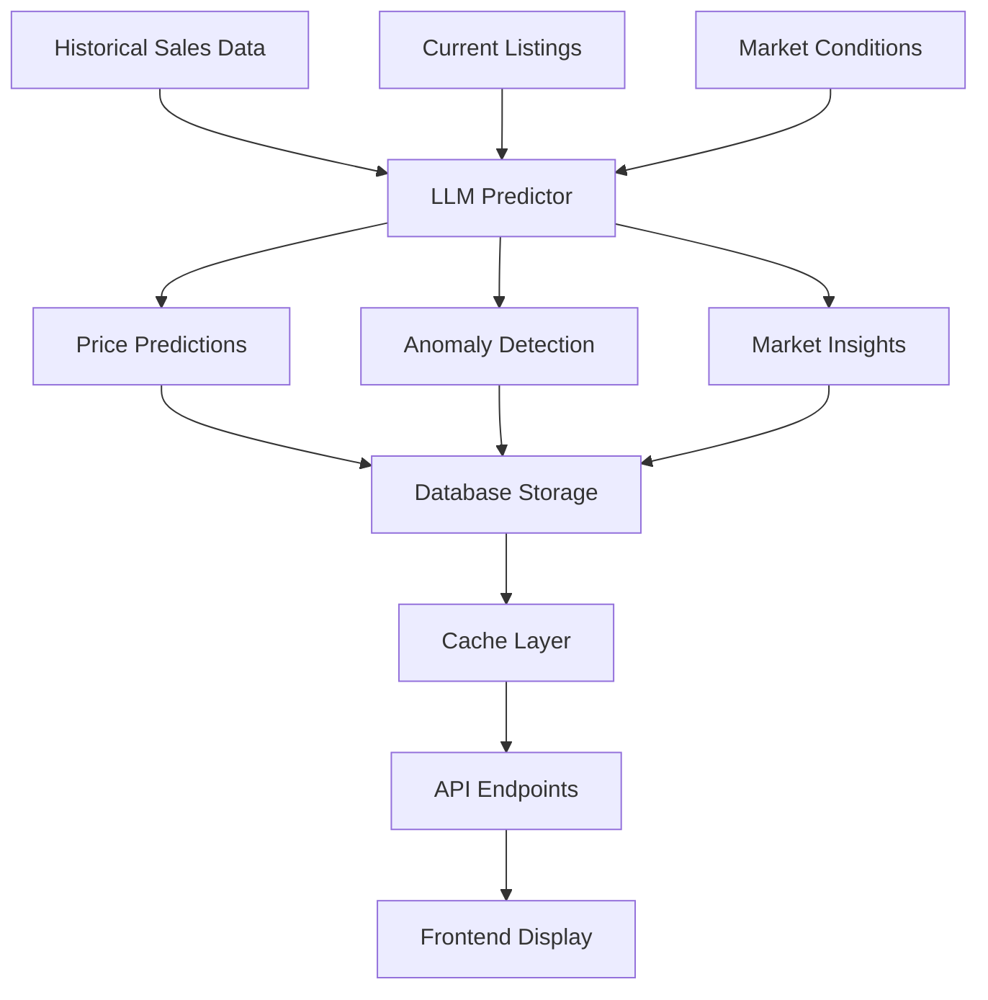

# LLM-Powered Analytics Platform

Welcome to the PorscheStats LLM Analytics Platform - an AI-powered market intelligence system that transforms raw Porsche sales data into actionable insights, predictions, and recommendations.

## 🎯 Overview

This platform leverages advanced Large Language Models (LLMs) to provide sophisticated market analysis that goes far beyond traditional statistical analytics. It offers price predictions, anomaly detection, market insights, and investment recommendations powered by OpenAI's GPT-4.

## 📚 Documentation

### Planning Documents
- **[Product Requirements Document (PRD)](./PRD.md)** - Complete feature specifications and business requirements
- **[Technical Implementation Plan](./technical-plan.md)** - Detailed architecture and implementation strategy
- **[Prompt Templates & Examples](./prompts.md)** - LLM prompt engineering and examples

### Key Features

#### 🔮 Price Prediction Engine
- **Multi-horizon forecasting** (1 month to 1 year)
- **Confidence scoring** with statistical backing
- **Scenario analysis** (optimistic/pessimistic/realistic)
- **Mileage and options impact** modeling

#### 🚨 Anomaly Detection System
- **Undervalued listing identification** with opportunity scoring
- **Market movement alerts** for unusual price patterns
- **Data quality assessment** and listing validation
- **Real-time monitoring** of new listings

#### 🧠 Natural Language Insights
- **Automated market reports** in plain English
- **Conversational analytics** with natural language queries
- **Trend explanations** with context and reasoning
- **Personalized insights** based on user interests

#### 💰 Investment Intelligence
- **Buy/sell/hold recommendations** with detailed rationale
- **Portfolio optimization** across multiple Porsches
- **Market timing analysis** and seasonal patterns
- **ROI projections** and risk assessments

#### 🛠️ Options Value Engineering
- **Option premium tracking** and ROI analysis
- **Rarity impact assessment** on values
- **Configuration optimization** for maximum value retention
- **Market preference trends** by region and demographic

## 🏗️ Architecture

### Core Components

```
📁 lib/analytics/
├── llm-predictor.ts          # Core LLM prediction engine
├── engines/                  # Specialized analysis engines
│   ├── market-analysis.ts    # Market trend analysis
│   ├── options-value.ts      # Options value analysis
│   └── investment.ts         # Investment recommendations
└── cache/                    # Intelligent caching layer

📁 scripts/analytics/
├── generate-market-insights.ts # Main insights generation script
├── detect-anomalies.ts        # Anomaly detection pipeline
├── validate-predictions.ts    # Prediction accuracy validation
└── monitor-costs.ts           # API cost monitoring

📁 .github/workflows/
└── market-insights.yml        # Automated analysis workflows
```

### Data Flow



## 🚀 Getting Started

### Prerequisites

1. **Environment Variables**
   ```bash
   OPENAI_API_KEY=your_openai_api_key
   SUPABASE_URL=your_supabase_url
   SUPABASE_SERVICE_ROLE_KEY=your_service_role_key
   ```

2. **Database Setup**
   - Run the database migrations in `/supabase/migrations/`
   - Ensure all tables are created (see technical plan for schema)

3. **Dependencies**
   ```bash
   npm install
   ```

### Basic Usage

#### Generate Daily Market Insights
```bash
tsx scripts/analytics/generate-market-insights.ts --type=daily
```

#### Generate Price Predictions for Specific Model
```bash
tsx scripts/analytics/generate-market-insights.ts \
  --type=model-specific \
  --model=911 \
  --trim="GT3"
```

#### Validate Previous Predictions
```bash
tsx scripts/analytics/generate-market-insights.ts \
  --type=daily \
  --validate
```

#### Dry Run (Preview without execution)
```bash
tsx scripts/analytics/generate-market-insights.ts \
  --type=weekly \
  --dry-run
```

### API Integration

#### Basic Price Prediction
```typescript
import { LLMPredictor } from '@/lib/analytics/llm-predictor';

const predictor = new LLMPredictor();

const prediction = await predictor.predictPrices({
  model: '911',
  trim: 'GT3',
  timeHorizon: '3m'
});

console.log(`Predicted price range: $${prediction.predictedPriceLow:,} - $${prediction.predictedPriceHigh:,}`);
console.log(`Confidence: ${(prediction.confidenceScore * 100).toFixed(1)}%`);
```

#### Anomaly Detection
```typescript
const anomalies = await predictor.detectAnomalies(recentListings);

const undervaluedCars = anomalies.filter(a => 
  a.anomalyType === 'undervalued' && 
  a.severity === 'high'
);

console.log(`Found ${undervaluedCars.length} potentially undervalued opportunities`);
```

#### Market Insights Generation
```typescript
const insight = await predictor.generateMarketInsights(
  'market_summary',
  '911',
  'GT3'
);

console.log(insight.title);
console.log(insight.summary);
```

## 🤖 Automated Workflows

### GitHub Actions

The platform includes automated workflows that run on scheduled intervals:

#### Daily Analysis (6 AM UTC)
- Market summary generation
- Anomaly detection for new listings
- Trending models analysis
- Undervalued listing identification

#### Weekly Analysis (Monday 8 AM UTC)
- Comprehensive market reports
- Price predictions for top models
- Seasonal trend analysis
- Investment recommendations
- Prediction validation

#### Manual Triggers
- Model-specific deep analysis
- Custom time range analysis
- Force regeneration of insights
- Cost monitoring and optimization

### Workflow Configuration

```yaml
# Manual trigger example
on:
  workflow_dispatch:
    inputs:
      insight_type:
        type: choice
        options: [daily, weekly, model-specific]
      model:
        type: string
      force_regeneration:
        type: boolean
```

## 💰 Cost Management

### Intelligent Caching Strategy

- **Short-term cache** (1 hour): Real-time anomaly detection
- **Medium-term cache** (6 hours): Price predictions  
- **Long-term cache** (24 hours): Market summaries
- **Persistent cache** (1 week): Historical analysis

### Cost Optimization Features

- **Batch processing** to minimize API calls
- **Prompt engineering** for token efficiency
- **Model selection** based on task complexity
- **Rate limiting** to prevent cost spikes
- **Usage monitoring** with alert thresholds

### Typical Monthly Costs

| Feature | API Calls/Month | Est. Cost |
|---------|----------------|-----------|
| Daily Insights | ~30 | $15-30 |
| Weekly Analysis | ~4 | $20-40 |
| Anomaly Detection | ~100 | $25-50 |
| Price Predictions | ~50 | $30-60 |
| **Total** | ~184 | **$90-180** |

*Costs based on GPT-4 Turbo pricing and typical usage patterns*

## 📊 Performance Metrics

### Response Time Targets
- **Real-time anomaly detection**: < 5 seconds
- **Price predictions**: < 10 seconds  
- **Market insights**: < 15 seconds
- **Batch analysis**: < 5 minutes

### Accuracy Goals
- **3-month price predictions**: ±10% accuracy target
- **Anomaly detection**: >90% precision for high-severity alerts
- **Trend predictions**: >85% directional accuracy
- **Undervalued identification**: >75% success rate on recommendations

### Cache Performance
- **Cache hit rate**: >70% target for repeated queries
- **Cost reduction**: 60-80% through intelligent caching
- **Response time improvement**: 90% faster for cached responses

## 🛡️ Security & Privacy

### Data Protection
- **No PII in LLM requests** - All personal data stripped
- **API key encryption** - Secure environment variable storage
- **Rate limiting** - Prevents abuse and cost overruns
- **Audit logging** - Complete tracking of LLM interactions

### Compliance Features
- **Financial advice disclaimers** - Clear limitations on predictions
- **Data retention policies** - Automatic cleanup of expired data
- **User consent tracking** - Opt-in for personalized insights
- **Transparency reports** - Explanation of AI recommendations

## 🔧 Configuration

### LLM Provider Settings

```typescript
// Default configuration
const defaultConfig = {
  provider: 'openai',
  model: 'gpt-4-turbo-preview',
  temperature: 0.1,        // Low for consistent predictions
  maxTokens: 2000,         // Balanced for cost/quality
  cacheEnabled: true,
  cacheTTL: 21600         // 6 hours default
};
```

### Prompt Versioning

All prompts are versioned and stored in the database:

- **Version control** for prompt improvements
- **A/B testing** capability for prompt optimization  
- **Rollback support** for problematic prompts
- **Performance tracking** by prompt version

## 📈 Monitoring & Observability

### Key Metrics Dashboard
- **Prediction accuracy** trends over time
- **API response times** and error rates
- **Cost per insight** and budget tracking
- **User engagement** with AI features

### Alerting Configuration
- **Cost threshold breaches** (daily/monthly limits)
- **Prediction accuracy degradation** below targets
- **API failures** or timeout alerts
- **Anomaly detection** false positive rates

## 🧪 Testing Strategy

### Automated Testing
- **Unit tests** for core prediction algorithms
- **Integration tests** for end-to-end workflows
- **Performance tests** for response time requirements
- **Cost simulation** tests for budget validation

### Validation Framework
- **Historical backtesting** of prediction accuracy
- **A/B testing** for prompt effectiveness
- **User feedback** integration for quality improvement
- **Market outcome** validation for predictions

## 🚀 Deployment

### Development Environment
```bash
# Install dependencies
npm install

# Set up environment variables
cp .env.example .env.local

# Run development server
npm run dev

# Test LLM integration
tsx scripts/analytics/generate-market-insights.ts --dry-run
```

### Production Deployment
```bash
# Build for production
npm run build

# Deploy to Vercel
npm run deploy

# Verify GitHub Actions
# Check .github/workflows/market-insights.yml
```

### Environment Configuration

| Environment | Purpose | LLM Budget | Cache TTL |
|-------------|---------|------------|-----------|
| Development | Testing | $10/month | 1 hour |
| Staging | Pre-production | $25/month | 3 hours |
| Production | Live platform | $150/month | 6 hours |

## 📋 Troubleshooting

### Common Issues

#### High API Costs
```bash
# Check cost monitoring
tsx scripts/analytics/monitor-costs.ts

# Review cache hit rates
# Optimize prompt efficiency
# Adjust cache TTL settings
```

#### Low Prediction Accuracy
```bash
# Validate with recent data
tsx scripts/analytics/generate-market-insights.ts --validate

# Check data quality issues
# Review prompt engineering
# Analyze edge cases
```

#### Cache Performance Issues
```bash
# Clear cache if needed
# Check cache hit rates
# Optimize cache keys
# Review TTL settings
```

## 🔮 Future Enhancements

### Planned Features
- **Multi-provider LLM support** (Anthropic Claude, Google Gemini)
- **Computer vision** integration for condition assessment
- **Blockchain verification** for authenticity tracking
- **Social trading** features for collector communities

### Advanced Analytics
- **Sentiment analysis** from listing descriptions
- **Economic indicator** correlation modeling
- **Regional market** variation analysis
- **Competitor brand** cross-analysis

## 🤝 Contributing

### Development Guidelines
1. **Follow TypeScript** strict mode requirements
2. **Add comprehensive tests** for new features
3. **Document prompt changes** with version notes
4. **Monitor cost impact** of new features
5. **Update documentation** for API changes

### Code Review Process
- **Security review** for LLM integrations
- **Cost impact** assessment for new features
- **Performance testing** for response times
- **Accuracy validation** for prediction changes

## 📞 Support

### Documentation
- [API Reference](../api/README.md)
- [Database Schema](../database/schema.md)
- [Deployment Guide](../deployment/README.md)

### Monitoring
- GitHub Actions workflow status
- Cost monitoring dashboard
- Performance metrics dashboard
- Error tracking and alerting

---

*This LLM Analytics Platform represents the cutting edge of AI-powered automotive market intelligence, providing PorscheStats users with unprecedented insights into the luxury car market.*