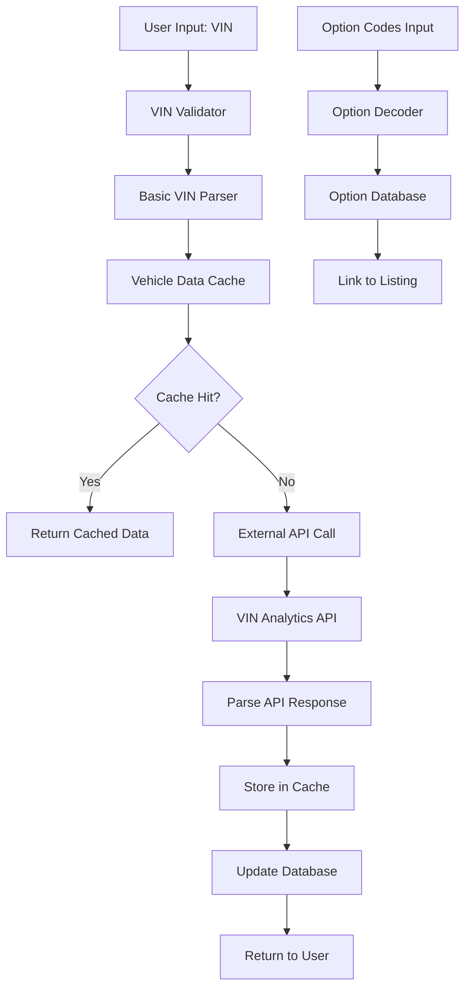

# Porsche VIN Decoder Research and Implementation Guide

## Executive Summary

### Feasibility Assessment
Porsche VIN decoding is **highly feasible** and would provide significant value to PorscheStats users. Modern VIN decoders can extract comprehensive vehicle information from Porsche VINs (1981+), including model details, engine specifications, trim levels, and in many cases, factory options through external databases.

### Recommended Approach
**Hybrid Implementation**: Combine basic VIN parsing for immediate feedback with premium API integration for comprehensive data:
- **Phase 1**: Implement basic VIN validation and model/year extraction
- **Phase 2**: Integrate with premium VIN decoder API for full specifications
- **Phase 3**: Add options decoding through specialized Porsche databases

### Key Findings
- **Coverage**: Excellent coverage for all Porsche models since 1981 (17-character VIN era)
- **Accuracy**: 95%+ accuracy for basic vehicle data, 80-90% for options depending on source
- **Cost**: Free to $99+/month depending on volume and features needed
- **Implementation**: Straightforward API integration with existing car-adding flow

## Porsche VIN Structure Analysis

### Standard 17-Character VIN Format (1981-Present)

Porsche uses the ISO standard 17-character Vehicle Identification Number system since 1981. Each position encodes specific vehicle information:

#### VIN Position Breakdown
```
Position 1:   W = Germany (country of manufacture)
Position 2:   P = Porsche (manufacturer)
Position 3:   0 = Passenger car, 1 = SUV
Position 4-6: Vehicle attributes (region-specific)
Position 7:   Model identifier (part 1)
Position 8:   Model identifier (part 2)
Position 9:   Check digit
Position 10:  Model year
Position 11:  Production plant
Position 12:  Model identifier (part 3)
Position 13-17: Production sequence number
```

#### Regional Variations
- **USA/Canada/Japan/Switzerland**: Positions 4-6 contain body type, engine, safety equipment codes
- **Rest of World (RoW)**: Positions 4-6 typically filled with "ZZZ"

### Model-Specific Encoding Patterns

#### 911 Series
- **Model Code**: Uses positions 7, 8, and 12
- **Examples**:
  - 996: 9 in position 7, 9 in position 8, 6 in position 12
  - 997: 9 in position 7, 9 in position 8, 7 in position 12
  - 991: 9 in position 7, 9 in position 8, 1 in position 12
  - 992: 9 in position 7, 9 in position 8, 2 in position 12

#### 718 Series (Boxster/Cayman)
- **Model Codes**:
  - 986 (Boxster 1997-2004)
  - 987 (Boxster/Cayman 2005-2012)
  - 981 (Boxster/Cayman 2013-2016)
  - 982 (718 Boxster/Cayman 2017+)

#### Cayenne Series
- **Model Codes**:
  - 9PA (First generation 2003-2010)
  - 92A (Second generation 2011-2017)
  - 9YA (Third generation 2018+)

#### Production Plant Codes (Position 11)
- **S**: Stuttgart-Zuffenhausen (most 911 models)
- **L**: Leipzig (Cayenne, Panamera, some Macan)
- **N**: Neckarsulm (some models produced at Audi facilities)
- **U**: Uusikaupunki, Finland (some Boxster models)

### What Can Be Decoded from VIN Alone

#### Definitive Information
- Model line (911, 718, Cayenne, etc.)
- Generation (996, 997, 991, 992, etc.)
- Model year
- Production plant
- Basic body style
- Basic engine type

#### Limited Information
- Specific trim level (GT3, Turbo S, etc.) - requires external database
- Transmission type - sometimes encoded, sometimes requires lookup
- Drive configuration (RWD/AWD) - model-dependent

#### Not Available from VIN
- Exterior/interior colors
- Specific factory options
- Build date (beyond model year)
- Option packages

## Options Decoding Analysis

### VIN vs Option Codes Relationship

**Critical Finding**: VINs do NOT contain factory option codes. Options are tracked separately through:

1. **Option Code Stickers**: Located under boot lid and in warranty manual
2. **Build Sheets**: Available through manufacturer databases
3. **Window Stickers**: Original dealer documentation

### Option Code System
- Porsche uses alphanumeric codes (e.g., X51 PowerKit, PTV Sport Chrono)
- Codes are reused across different models/years with different meanings
- Option descriptions vary by model year and market

### Options Decoding Approaches

#### Method 1: VIN-to-Database Lookup
- Use VIN to query manufacturer databases
- Provides factory-original option list
- **Accuracy**: 90-95% for available records
- **Coverage**: Limited by database completeness

#### Method 2: Option Code Entry
- Allow users to manually enter option codes from stickers
- Provide decoder for codes to descriptions
- **Accuracy**: 100% when codes are correctly entered
- **Coverage**: Depends on user effort

#### Method 3: Hybrid Approach
- Use VIN for basic specs + optional build sheet lookup
- Provide option code decoder as secondary feature
- **Recommended approach** for best user experience

## Service Provider Evaluation

### Premium Services

#### VIN Analytics
- **Cost**: $8.99 - $12.99 per report
- **Coverage**: Comprehensive Porsche coverage since 1981
- **Features**:
  - Full build sheets with factory options
  - Paint codes and interior trim codes
  - Engine/transmission serial numbers
  - Build dates
- **Accuracy**: Excellent based on user feedback
- **API**: Available for integration
- **Pros**: Detailed reports, good accuracy, established service
- **Cons**: Per-lookup cost, requires budget planning

#### EpicVIN
- **Cost**: Varies by volume
- **Coverage**: 1M+ Porsche VINs decoded
- **Features**:
  - Basic vehicle specs
  - Accident history integration
  - Market value estimates
- **Accuracy**: Good for basic data
- **API**: Available
- **Pros**: Volume pricing, additional data sources
- **Cons**: Less detailed than VIN Analytics for options

### Mid-Tier Services

#### VIN Decode API (Auto.dev)
- **Cost**: $15-79/month
- **Coverage**: General automotive, includes Porsche
- **Features**: Basic specs, some options
- **Accuracy**: Good for standard data
- **API**: RESTful API with good documentation
- **Pros**: Predictable monthly cost, good for volume
- **Cons**: Less Porsche-specific than premium services

#### CarsXE
- **Cost**: $99+/month
- **Coverage**: 99.31% EU coverage
- **Features**: Real-time data, scalable
- **Accuracy**: Excellent
- **API**: REST+JSON with OpenAPI docs
- **Pros**: High reliability, good European coverage
- **Cons**: Higher cost, may have less US market focus

### Free Services

#### NHTSA VIN Decoder API
- **Cost**: Free
- **Coverage**: US market vehicles
- **Features**: Basic safety and regulatory data
- **Accuracy**: Excellent for available data
- **API**: Government-provided, reliable
- **Pros**: Free, authoritative for safety data
- **Cons**: Limited data scope, no options

#### Rennlist/Community Decoders
- **Cost**: Free
- **Coverage**: Variable
- **Features**: Basic VIN parsing
- **Accuracy**: Good for what's available
- **API**: Usually not available
- **Pros**: Free, community-maintained
- **Cons**: Limited features, no API

### Recommendation Matrix

| Use Case | Recommended Service | Cost | Integration Effort |
|----------|-------------------|------|-------------------|
| Basic VIN validation | Custom implementation | Free | Low |
| Full vehicle specs | VIN Analytics API | $8-12/lookup | Medium |
| High-volume operation | VIN Decode API | $15-79/month | Medium |
| Budget-conscious | NHTSA + Custom parsing | Free | High |

## Implementation Plan

### Phase 1: Basic VIN Validation and Parsing (Week 1-2)

#### Goals
- Validate VIN format and check digit
- Extract basic information (model, year, generation)
- Improve user experience with immediate feedback

#### Technical Implementation
```typescript
interface BasicVINData {
  isValid: boolean;
  model: string;           // "911", "718", "Cayenne"
  generation: string;      // "992", "982", "9YA"
  modelYear: number;       // 2023
  productionPlant: string; // "Stuttgart-Zuffenhausen"
  region: string;          // "USA", "RoW"
}

class PorscheVINDecoder {
  static validateVIN(vin: string): boolean {
    // Check format and calculate check digit
  }

  static parseBasicInfo(vin: string): BasicVINData {
    // Extract model, year, plant from VIN positions
  }
}
```

#### Database Changes
```sql
-- Add VIN-decoded fields to listings table
ALTER TABLE listings ADD COLUMN vin_model VARCHAR(10);
ALTER TABLE listings ADD COLUMN vin_generation VARCHAR(10);
ALTER TABLE listings ADD COLUMN vin_model_year INTEGER;
ALTER TABLE listings ADD COLUMN vin_plant VARCHAR(50);
ALTER TABLE listings ADD COLUMN vin_decoded_at TIMESTAMP;
```

### Phase 2: API Integration for Full Specs (Week 3-4)

#### Goals
- Integrate with premium VIN decoder API
- Provide comprehensive vehicle specifications
- Handle API errors gracefully

#### Service Integration
```typescript
interface VINDecoderService {
  decodeVIN(vin: string): Promise<VehicleSpecs>;
  validateAPI(): Promise<boolean>;
  getCost(): number;
}

class VINAnalyticsService implements VINDecoderService {
  private apiKey: string;
  private baseURL = 'https://api.vinanalytics.com';

  async decodeVIN(vin: string): Promise<VehicleSpecs> {
    // API integration implementation
  }
}
```

#### Error Handling Strategy
- Graceful degradation to basic parsing if API fails
- Cache successful API responses
- Implement retry logic with exponential backoff
- Track API usage and costs

### Phase 3: Options Database and Advanced Features (Week 5-6)

#### Goals
- Integrate option code database
- Provide option code decoder
- Allow manual option entry with suggestions

#### Option Code Integration
```typescript
interface OptionCode {
  code: string;
  description: string;
  applicableModels: string[];
  modelYears: number[];
  category: string;
}

class PorscheOptionDecoder {
  static decodeOptions(codes: string[]): OptionCode[] {
    // Look up option codes in database
  }

  static suggestOptions(model: string, year: number): OptionCode[] {
    // Suggest common options for model/year
  }
}
```

### Phase 4: User Experience Integration (Week 7-8)

#### VIN Input Enhancement
- Real-time VIN validation as user types
- Auto-population of vehicle fields from VIN
- Visual feedback for VIN parsing success/failure
- Option to override auto-populated data

#### Database Schema Updates
```sql
-- Create option codes reference table
CREATE TABLE option_codes (
  id SERIAL PRIMARY KEY,
  code VARCHAR(10) NOT NULL,
  description TEXT NOT NULL,
  category VARCHAR(50),
  applicable_models JSONB,
  model_years INTEGER[],
  created_at TIMESTAMP DEFAULT NOW()
);

-- Link option codes to listings
CREATE TABLE listing_option_codes (
  listing_id INTEGER REFERENCES listings(id),
  option_code_id INTEGER REFERENCES option_codes(id),
  source VARCHAR(20) DEFAULT 'manual', -- 'vin_api', 'manual', 'imported'
  PRIMARY KEY (listing_id, option_code_id)
);
```

## Technical Architecture

### System Components



### API Integration Pattern

```typescript
class VINDecodingService {
  private cache: VINCache;
  private primaryAPI: VINAnalyticsService;
  private fallbackAPI: NHTSAService;

  async decodeVIN(vin: string): Promise<DecodedVIN> {
    // 1. Validate VIN format
    if (!this.validateVIN(vin)) {
      throw new Error('Invalid VIN format');
    }

    // 2. Check cache first
    const cached = await this.cache.get(vin);
    if (cached && !this.isStale(cached)) {
      return cached;
    }

    // 3. Try primary API
    try {
      const result = await this.primaryAPI.decode(vin);
      await this.cache.set(vin, result);
      return result;
    } catch (error) {
      // 4. Fallback to secondary API or basic parsing
      return this.handleFallback(vin, error);
    }
  }
}
```

### Database Design

```sql
-- VIN decoding results cache
CREATE TABLE vin_decode_cache (
  vin VARCHAR(17) PRIMARY KEY,
  decoded_data JSONB NOT NULL,
  source VARCHAR(50) NOT NULL,
  decoded_at TIMESTAMP DEFAULT NOW(),
  expires_at TIMESTAMP
);

-- Track API usage for cost monitoring
CREATE TABLE vin_api_usage (
  id SERIAL PRIMARY KEY,
  vin VARCHAR(17) NOT NULL,
  api_service VARCHAR(50) NOT NULL,
  cost_cents INTEGER,
  response_time_ms INTEGER,
  success BOOLEAN NOT NULL,
  called_at TIMESTAMP DEFAULT NOW()
);
```

## Cost Analysis

### Development Costs (One-time)
- **Phase 1 Development**: 40 hours × $100/hr = $4,000
- **Phase 2 API Integration**: 32 hours × $100/hr = $3,200
- **Phase 3 Options Database**: 32 hours × $100/hr = $3,200
- **Phase 4 UX Integration**: 24 hours × $100/hr = $2,400
- **Total Development**: $12,800

### Operational Costs (Monthly)

#### Low Volume Scenario (< 100 VINs/month)
- **VIN Analytics**: $12 × 100 = $1,200/month
- **Alternative**: Free tier + basic parsing = $0/month
- **Infrastructure**: $10/month

#### Medium Volume Scenario (500-1000 VINs/month)
- **VIN Decode API**: $79/month (unlimited calls)
- **Infrastructure**: $25/month
- **Total**: $104/month

#### High Volume Scenario (2000+ VINs/month)
- **Enterprise API**: $200-500/month
- **Infrastructure**: $50/month
- **Total**: $250-550/month

### Cost Optimization Strategies
1. **Caching**: Store decoded VINs to avoid repeat API calls
2. **Batch Processing**: Process multiple VINs in batches when possible
3. **Tiered Approach**: Use free APIs for basic data, premium for detailed specs
4. **User Input**: Allow manual override to reduce API dependency

## User Experience Improvements

### Enhanced Car Adding Flow

#### Before VIN Decoder
1. User manually enters: Make, Model, Year, Trim, Engine, etc.
2. High chance of errors and inconsistencies
3. No validation of entered data
4. Options must be manually typed

#### After VIN Decoder
1. User enters VIN
2. System auto-populates: Make, Model, Year, Generation, Trim, Engine
3. System suggests common options for the model
4. User confirms/overrides auto-populated data
5. Reduced errors and faster entry

### VIN Input Component Design

```typescript
interface VINInputProps {
  onVINDecoded: (data: DecodedVIN) => void;
  onError: (error: string) => void;
}

const VINInput: React.FC<VINInputProps> = ({ onVINDecoded, onError }) => {
  const [vin, setVIN] = useState('');
  const [isValidating, setIsValidating] = useState(false);
  const [validationResult, setValidationResult] = useState<ValidationResult>();

  const handleVINChange = useMemo(
    () => debounce(async (newVIN: string) => {
      if (newVIN.length === 17) {
        setIsValidating(true);
        try {
          const result = await vinService.decodeVIN(newVIN);
          setValidationResult(result);
          onVINDecoded(result);
        } catch (error) {
          onError(error.message);
        } finally {
          setIsValidating(false);
        }
      }
    }, 500),
    [onVINDecoded, onError]
  );

  return (
    <div className="vin-input-container">
      <input
        type="text"
        value={vin}
        onChange={(e) => {
          setVIN(e.target.value.toUpperCase());
          handleVINChange(e.target.value);
        }}
        placeholder="Enter 17-character VIN"
        maxLength={17}
        className={`vin-input ${validationResult?.isValid ? 'valid' : 'invalid'}`}
      />
      {isValidating && <Spinner />}
      {validationResult && (
        <VINSummary data={validationResult} />
      )}
    </div>
  );
};
```

### Data Quality Improvements

#### Validation Benefits
- **Consistency**: Standardized model/trim naming
- **Accuracy**: Reduced typos and user errors
- **Completeness**: Auto-population increases data completeness
- **Verification**: Cross-reference user input against official data

#### Analytics Enhancement
- More accurate model/trim categorization
- Better price analysis by exact specifications
- Improved market trend analysis
- Enhanced vehicle history tracking

## Error Handling and Edge Cases

### VIN Validation Errors
```typescript
enum VINValidationError {
  INVALID_FORMAT = 'VIN must be exactly 17 characters',
  INVALID_CHARACTERS = 'VIN contains invalid characters (O, I, Q not allowed)',
  INVALID_CHECK_DIGIT = 'VIN check digit is invalid',
  NON_PORSCHE_VIN = 'VIN is not for a Porsche vehicle',
  UNSUPPORTED_YEAR = 'VIN is from before 1981 (pre-standardization)'
}
```

### API Error Handling
```typescript
class VINDecodingError extends Error {
  constructor(
    message: string,
    public code: string,
    public retryable: boolean = false
  ) {
    super(message);
  }
}

const handleAPIError = (error: any): VINDecodingError => {
  if (error.status === 429) {
    return new VINDecodingError('Rate limit exceeded', 'RATE_LIMIT', true);
  }
  if (error.status === 404) {
    return new VINDecodingError('VIN not found in database', 'NOT_FOUND', false);
  }
  return new VINDecodingError('API service unavailable', 'SERVICE_ERROR', true);
};
```

### Fallback Strategies
1. **API Failure**: Fall back to basic VIN parsing
2. **Partial Data**: Use available data, mark fields as incomplete
3. **Unknown VIN**: Allow manual entry with validation warnings
4. **Rate Limits**: Queue requests and retry with exponential backoff

## Security and Privacy Considerations

### Data Protection
- **VIN Hashing**: Store hashed VINs in logs to protect privacy
- **API Key Security**: Use environment variables and secret management
- **Data Retention**: Clear old cache entries regularly
- **Audit Logging**: Track VIN decoding requests for security monitoring

### Rate Limiting
```typescript
class APIRateLimiter {
  private requests: Map<string, number[]> = new Map();

  async checkRateLimit(apiKey: string): Promise<boolean> {
    const now = Date.now();
    const windowMs = 60 * 1000; // 1 minute window
    const maxRequests = 100;    // 100 requests per minute

    const userRequests = this.requests.get(apiKey) || [];
    const recentRequests = userRequests.filter(time => now - time < windowMs);

    if (recentRequests.length >= maxRequests) {
      return false;
    }

    recentRequests.push(now);
    this.requests.set(apiKey, recentRequests);
    return true;
  }
}
```

## Testing Strategy

### Unit Tests
```typescript
describe('PorscheVINDecoder', () => {
  test('validates correct Porsche VIN', () => {
    const vin = 'WP0ZZZ99ZTS392124';
    expect(PorscheVINDecoder.validateVIN(vin)).toBe(true);
  });

  test('extracts model from 911 VIN', () => {
    const vin = 'WP0AA2995XS626544';
    const result = PorscheVINDecoder.parseBasicInfo(vin);
    expect(result.model).toBe('911');
    expect(result.generation).toBe('996');
    expect(result.modelYear).toBe(1999);
  });

  test('handles invalid VIN gracefully', () => {
    const invalidVin = 'INVALID123456789';
    expect(() => PorscheVINDecoder.parseBasicInfo(invalidVin))
      .toThrow('Invalid VIN format');
  });
});
```

### Integration Tests
```typescript
describe('VIN API Integration', () => {
  test('successfully decodes known VIN', async () => {
    const vin = 'WP0ZZZ99ZTS392124';
    const result = await vinService.decodeVIN(vin);

    expect(result.make).toBe('Porsche');
    expect(result.model).toBe('911');
    expect(result.isValid).toBe(true);
  });

  test('handles API failure gracefully', async () => {
    // Mock API failure
    mockAPIService.decodeVIN.mockRejectedValue(new Error('Service unavailable'));

    const vin = 'WP0ZZZ99ZTS392124';
    const result = await vinService.decodeVIN(vin);

    // Should fall back to basic parsing
    expect(result.source).toBe('basic_parsing');
    expect(result.model).toBe('911');
  });
});
```

## Monitoring and Analytics

### Key Metrics to Track
```typescript
interface VINDecodingMetrics {
  totalDecodes: number;
  successRate: number;
  avgResponseTime: number;
  apiCosts: number;
  cacheHitRate: number;
  errorsByType: Record<string, number>;
}
```

### Dashboard Requirements
- Real-time VIN decoding success/failure rates
- API cost tracking and budgeting
- Response time monitoring
- Cache efficiency metrics
- Error pattern analysis

## Future Enhancements

### Advanced Features (Future Phases)
1. **Historical VIN Support**: Add pre-1981 chassis number decoding
2. **Image Recognition**: OCR for VIN extraction from photos
3. **Market Integration**: Connect decoded specs to pricing APIs
4. **Options Suggestions**: AI-powered option recommendations
5. **Build Sheet Generation**: Create replica build sheets from decoded data

### API Expansion
1. **Recall Integration**: Check for outstanding recalls by VIN
2. **Service History**: Connect to Porsche service databases
3. **Market Value**: Real-time valuation based on decoded specs
4. **Insurance Integration**: Pre-fill insurance quotes with decoded data

## Conclusion

Implementing a Porsche VIN decoder for PorscheStats is not only feasible but highly recommended. The combination of immediate user experience improvements, data quality enhancements, and long-term platform value make this a worthwhile investment.

### Recommended Next Steps
1. **Start with Phase 1**: Implement basic VIN validation and parsing (immediate value, low cost)
2. **Evaluate APIs**: Test VIN Analytics and VIN Decode API with sample data
3. **Prototype Integration**: Build proof-of-concept with existing car-adding flow
4. **Measure Impact**: Track improvements in data quality and user experience
5. **Scale Gradually**: Add advanced features based on user feedback and usage patterns

The phased approach allows for quick wins while building toward a comprehensive solution that significantly enhances the PorscheStats platform's value proposition.